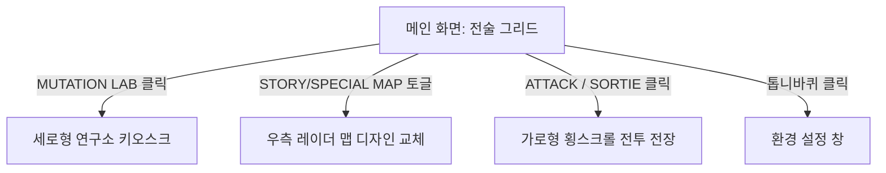

# 메인 화면 UI/UX 기획서 (Main Menu UI/UX Specification)

이 문서는 프로젝트 **매드 오버로드 (MAD OVERLORD)**의 메인 전술 화면의 UI/UX 설계 및 레이아웃 배치안을 명세합니다.

---

## 1. 개편된 전술 그리드 레이아웃 (Tactical Grid Layout v2)

V의 피드백을 반영하여 복잡한 메뉴 바를 배제하고, 좌측의 몬스터 관리 영역과 우측의 전장 맵 타겟팅 영역으로 직관화한 설계안입니다.

### 🖼️ 시안 이미지 참조
* **[최종 개편 시안 B v2](file:///e:/Project/SelfMovingGame/MD/ui_draft_b_v2.png)**
* **[초기 디자인 시안 B v1](file:///e:/Project/SelfMovingGame/MD/ui_draft_b_v1.png)**

---

## 2. 화면 영역별 구성 명세

### ① 좌측 패널: 오버로드 대기실 (Overlord Showroom)
* **몬스터 Live2D 모델링**: 현재 조립/장착된 파츠가 결합된 완성형 몬스터가 숨쉬기(Idle) 모션으로 렌더링됩니다.
* **[MUTATION LAB] 버튼**: 
  - 위치: 몬스터 모델링 바로 하단.
  - 기능: 클릭 시 세로형 연구실 파츠 장착 및 스탯 강화 키오스크 화면으로 줌인 전환됩니다.

### ② 우측 패널: 홀로그램 전술 레이더 (Tactical Radar Map)
* **홀로그램 전장 지도**: 현재 구역의 성을 중심으로 공격 타겟 포인트와 거점 도달 경로가 표시됩니다.
* **스테이지 맵 토글 버튼 (2종)**:
  - **[STORY MAP]**: 시나리오 전개를 위한 기본 1-1, 1-2 등 스토리 진격 맵 활성화.
  - **[SPECIAL MAP]**: 타임어택이 배제된 성장용 '무제한 파밍 스테이지' 및 보스 레이드 랭킹전용 '엘리트 챌린지 스테이지' 맵 활성화.

### ③ 하단 중앙: 작전 출격 통제 패널 (Main Action Panel)
* **[ATTACK / SORTIE] 버튼**:
  - 위치: 화면 중앙 최하단.
  - 디자인: 빗금 형태의 노란색/검은색 위험(Warning) 공사 스트라이프 무늬로 제작하여 시각적 강조 극대화.
  - 기능: 클릭 시 선택한 스테이지 가로형 횡스크롤 전투 전장으로 출격합니다.

### ④ 우상단: 설정 및 정보 영역 (Utility & Top Bar)
* **세재화 정보**: 보유하고 있는 일반 재화 및 특수 재화 인디케이터.
* **[세팅] 버튼 (톱니바퀴 아이콘)**: 
  - 기존 하단 푸터 바에 있던 복잡한 세팅 버튼을 우상단으로 깔끔하게 통합하여 화면 개방감을 높였습니다.

---

## 3. 화면 전환 및 흐름도 (UX Flow)

