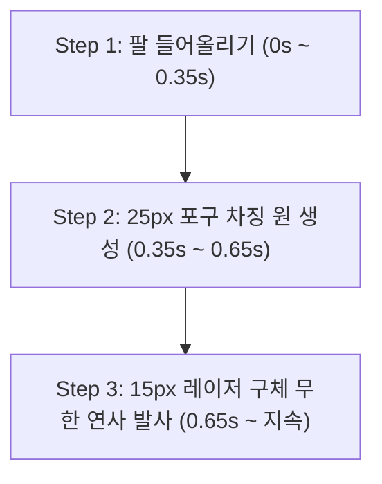

# 🛠️ 디자인 & 엔진 v2 아키텍처 적용 사항 명세서

**작성일자**: 2026년 07월 26일  
**프로젝트**: MAD OVERLORD // 디커플드 엔진 v2  
**대상 모듈**: `js/engine_v2/renderer.js`, `js/engine_v2/robotStructure.js`, `js/data/parts.js`, `js/ui/playground.js`

---

## 1. 가슴(Chest/Body) 중심 마운팅 앵커 DB (`BODY_ANCHORS_DB`)
가슴 몸통 파츠를 로봇 관절의 Origin `(0, 0)` 축으로 삼고, 상단 목(머리), 어깨 소켓(양팔), 둔부 소켓(양다리)의 상대 오프셋을 수치화하여 모듈화하였습니다.

```javascript
export const BODY_ANCHORS_DB = {
    'body_red_robot': {
        name: '기본 가슴',
        type: 'bipedal_robot',
        anchors: {
            headAnchor:     { offsetX: 0,   offsetY: -33 },
            leftArmAnchor:  { offsetX: 33,  offsetY: -12 },
            rightArmAnchor: { offsetX: -22, offsetY: -13 },
            leftLegAnchor:  { offsetX: 27,  offsetY: 42  },
            rightLegAnchor: { offsetX: 1,   offsetY: 46  }
        }
    }
};
```

---

## 2. 동적 기동 방식 스위처 (`recalculateAnchors`)
하체 기동 방식이 인간형 이족보행 관절(`pivot`)인지 전차 궤도/무한궤도(`track_vehicle` / `sprite`)인지에 따라, 렌더러가 앵커 계통과 애니메이션 모드를 동적으로 스위칭합니다.

- **관절형 (`pivot`)**: 어깨/둔부 피벗 축을 중심으로 회전 각도(`rotate`) 연산 적용.
- **궤도형 (`sprite`)**: 다리 관절 회전을 멈추고 스프라이트 시트 프레임 흐름 및 무한궤도 Y 위치로 자동 재배치.

---

## 3. 전신 연동 대기(Idle) 호흡 바운스 연출
가슴 몸통(`body`)이 대기 상태에서 위아래로 호흡 바운싱(`Math.sin(timeSec * 2.5) * 2.5`)할 때, 머리, 양팔, 양다리가 가슴 앵커 오프셋을 100% 동기화하여 유기적으로 한 덩어리가 되어 움직이도록 연동 보정하였습니다.

---

## 4. 파츠별 독립 오프셋 & 피벗 제어 시스템 (`customSize` / `offsetX`, `offsetY`)
기본 메카 파츠의 좌표와 비율에는 전혀 간섭을 주지 않으면서, 특정 파츠(예: `arm_mech_laser`)가 장착되었을 때만 전용 오프셋과 렌더 크기를 적용할 수 있도록 레이어 구조체를 확장하였습니다.

- **독립 오프셋 파이프라인**: `_bindSingleLayer`에서 파츠별 `customSize` (pivotX, pivotY, offsetX, offsetY, renderWidth, renderHeight)를 동적 수용하여 타 파츠에 영향을 주지 않고 오직 해당 파츠만 위치와 크기를 100% 독립 제어.

---

## 5. 렌더러 메모리 자산 캐싱 (`ImageCache`) & 동기식 즉시 재드로잉
- **`Renderer.imageCache`**: 한 번 로드되었거나 로드 완료된 자산 이미지(`HTMLImageElement`)를 메모리 캐시에 보관하여 파츠 변경 시 0초 만에 캐시된 이미지가 캔버스에 동기 교체 적용.
- **직결 1회 재드로잉**: 드롭다운 파츠 변경 시 애니메이션 재생/정지 상태와 상관없이 캔버스를 동기식 1회 즉시 강제 렌더링(`drawPaperDoll`)하여 반응속도 100% 보장.

---

## 6. 최상단 Z-Index 덮어쓰기 파티클 렌더링 (Post-Image Rendering)
파츠 실체 이미지 드로잉(`ctx.drawImage`)이 완결된 **직후 시점**에 포구 노즐 팁 위치로 이동하여 이펙트를 렌더링함으로써, 차징 원 빛과 발사체 구체가 레이저 포대 파츠 이미지 전면(Top-Most Z-Index) 위로 덮어씌워져 100% 선명하게 표출되는 레이어 파이프라인을 구축하였습니다.

---

## 7. 3단계 영화 같은 순차적 공격 애니메이션 시퀀스
'레이저 포대' 파츠 장착 시 발동되는 3단계 순차 공격 연출 시퀀스를 수립하였습니다.



1. **Step 1 [0s ~ 0.35s]**: 왼팔은 0도로 고정되고, 오른쪽 레이저 포대만 반시계 방향 30도(`-30°`)로 부드럽게 상승 조준. *(이 동안은 빛과 발사체가 생성되지 않음)*
2. **Step 2 [0.35s ~ 0.65s]**: 30도 각도로 완전 조준 고정된 후, 포구 노즐 팁에서 **직경 25px 차징 원(Charging Flash)이 찌잉- 파동을 일으키며 커짐**.
3. **Step 3 [0.65s ~ 지속]**: 차징 완수 후 포구 노즐 팁에서 **직경 15px 레이저 플라즈마 구체가 +45도 대각선 아래로 무한 연사 발사** 가동.

---

## 8. 실시간 시스템 & 파츠 디버그 로그 콘솔 (`#debug-log-console`)
플레이그라운드 Kiosk 우측 하단에 터미널 스타일 다크 로그 패널을 탑재하여, 파츠 선택/해제, 자산 이미지 경로, 앵커 연동, 애니메이션 트리거, 모드 전환 이벤트를 초단위 타임스탬프 기반 디버그 로그로 표출합니다.
